# A Crossover Strategy Based on Support and Resistance Lines

## Teammates

**Norman Yeo - nyeo2@illinois.edu (Team Leader)**
- Norman is a graduating Bachelor's Student at the University of Illinois at Urbana-Champaign in the Engineering Department majoring in Computer Science. Norman is graduating in May 2023. Norman is interested in the areas of low latency computing and cybersecurity.  

- Feel free to reach me my linkedin profile: https://www.linkedin.com/in/norman-yeo/


**King Chak Ho - kch6@illinois.edu**

- King is a graduating Master Student at the University of Illinois at Urbana-Champaign in the Mathematics Department majoring in Applied Mathematics. King is graduating in Dec 2022. King received his B.S. in Mathematics with Specialization in Computing from University of California, Los Angeles. King has broad interest and exposure in the areas of both mathematics and computer science such as probability, machine learning, and algorithms.


- Feel free to reach me at kch6@illinois.edu or my linkedin profile: https://www.linkedin.com/in/king-chak-ho/

**Yipu Jin - Yipujin2@illinois.edu**

- Yipu is a graduating Master Student at the University of Illinois at Urbana-Champaign in the Industrial & Enterprise System Engineering Department majoring in Financial Engineering. Yipu is graduating Dec. 2022. 

- Yipu has experience in quantitative research and data analysis: https://www.linkedin.com/in/yipujin/


**Yuhao Wang - yuhaow8@illinois.edu**

- Yuhao is a graduating Master Student at the University of Illinois at Urbana-Champaign in the Industrial & Enterprise System Engineering Department majoring in Financial Engineering. He will be graduating Dec. 2022.

- He has experience in mortgage research and trading strategy design, feel free to reach at yuhaow8@illinois.edu.

## Project Description:
This is the final report for semester long project for "IE498 - High Frequency Trading " Under [Prof. David Lariviere](https://davidl.web.illinois.edu).

Support and resistance levels are commonly used by traders, and our project aims to develop an algorithmic trading strategy based on those price levels using nano-second accurate data. 

A brief description of the trading strategy: 
- If a stock undercuts a prior support line and then rallies back above the line, we buy the stock. 
- If a stock rallies above a prior resistance level and then drops below that level, we short the stock. 

We further break down our project into four sections: market data, support and resistance levels identifications, strategy developement and analysis.

1. Market Data:
   
   The intraday market data sources for this project are the IEX Historical Data. We also use Yahoo Finance daily data to identify support and resistance levels for each stock.

2. Support and Resistance Levels Identifications:

   We wrote a Python script to identify the support and resistance levels for any stock using Yahoo Finance daily data, performed feature engineering on those price levels and then exported those price levels into csv files, which we used for strategy development.
   
3. Strategy Development:
   
   We used Strategy Studio to develop and backtest trading strategy. Strategy Studio is a proprietary software from RCM-X used for trading strategy development and testing. We wrote our trading strategy by implementing the StrategyStudio's Strategy interface. Then, we backtested our strategy in Strategy Studio using IEX Historical DEEPS Data Feed. The backtest results which included a profit and loss csv file was used to evaluate the strategy's performance.

4. Analysis:

   We wrote a python script to interpret the backtest csv file generated by Strategy Studio. We analyzed the strategy performance by generating visualizations and evaluating different metrics such as cummulative return percentage, sharpe ratio and maximum drawdown. 

## Technologies:
### Languages

Python

- Python was used for strategy research before implementation in C++. It more convenient to deal with market data inputs using Python. Python also provided visualizations to clearly show the trend of the backtest results. We also used Python to get yahoo finance data for research use.

C++

- C++ was used in Strategy Studio for data parser and backtesting. It is a high performance language and is ideal for strategy implementation.

### Databases

Yahoo Finance OHLC data

- We used 10 years Open High Low Close data of some stocks for initial strategy research. The data were obtained via the Python package yfinance. For OHLC data, yfinance would be better than IEX since it includes all US exchanges.

IEX daily data

- IEX daily data was used to backtest our strategy. We used Strategy Studio to capture intraday trading signals and implemented the strategy.

### Automated testing frameworks

Gitlab

- Gitlab was used for version control so that we can track changes on the project.

Virtual Box

- It was used to set up a virtual machine so that we can use Strategy Studio.

Strategy Studio

- It is a software for strategy development. We used it to implement the strategy and obtained the backtest results.

### Packages

This part will list packages that we used in Python.

- numpy
- pandas
- yfinance
- matplotlib
- plotly

Numpy and Pandas were used for matrix calculation and data manipulation. Yfinance was used to pull OHLC market data. Matplotlib and Plotly were used to generate trading signal plots and backtest result plots.

## Components:

- A block diagram of our project.

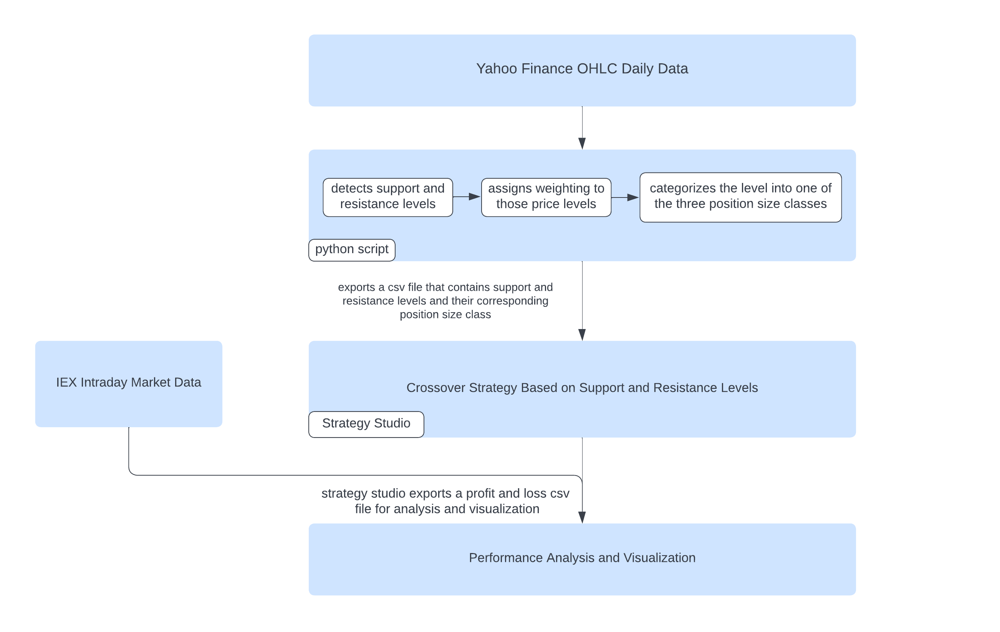

## Git Repo Layout:

```
├── backtest-analysis
│   ├── backtest-analysis.ipynb
│   ├── backtest-data
│   │   └── ...
│   └── pnl-percentage-graph.jpg
├── backtest.sh
├── Exp_Weights.ipynb
├── FinalReport.md
├── images
│   ├── ...
│   ├── results_image
│   │   ├── sectors
│   │   │   ├── ...
│   │   ├── ...
├── parse.sh
├── python_script
│   ├── data
│   │   ├── ...
│   ├── Exp_Weights.ipynb
│   ├── generate_list.py
│   ├── sector_research.ipynb
│   └── support_resistance.ipynb
├── readme.MD
└── strategy
    ├── Makefile
    ├── resistance.cpp
    ├── resistance.h
```
## Instruction for using project:
To run our compiled demo, follow these steps:
1. Download and install virtual box and vagrant
2. Clone professor's vagrant setup (https://gitlab.engr.illinois.edu/shared_code/strategystudioubuntu2004)
3. `cd strategystudioubuntu2004` and clone this repo
4. Using the recursively cloned repo `iexdownloadparser`, download and parse market data for the desired backtesting period and symbols. Details on directions of using the IEX downloader/parser can be found on the README.md under the project root directory.
5. `cd python_script` and  `./generate_list.py` modifying the script for the desired period and symbols. This will generate the list of support and resistance lines for the specified period for each symbol
7. Boot up vagrant machine and `cd /vagrant/ie41/strategy` and `make`
8. `../backtest.sh` to run the backtest. Modify the script for the desired backtesting period and symbols
9. Use results stored in `~/ss/bt/backtesting-results-cra` and the `backtest-analysis/backtest-analysis.ipynb` to analyze the results


## Detailed Description

Before delving into the strategy implementation, let us describe what support and resistance levels are.

### Support 
Support is the price level at which demand is thought to be strong enough to prevent the price from decling further. In the image below you can see that each time the price reaches the support level, it has difficulty penetrating that level. The logic is that as the price declines toward support and gets cheaper, buyers become more inclined to buy and sellers become less inclined to sell.

<!-- possibly add recent significant low -->

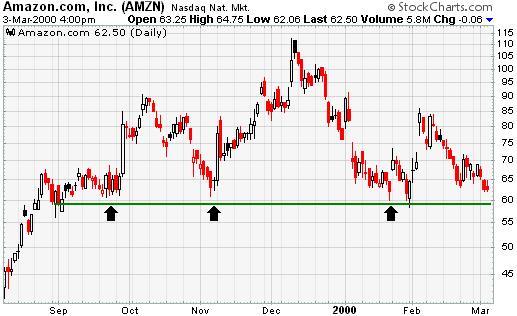

### Resistance
Resistance is the price level at which selling is thought to be strong enough to prevent the price from rising further. In the image below you can see that each time the price reaches the resistance level, it has difficulty moving higher. The logic is that as the price advances towards resistance, sellers become more inclined to sell and buyers become less inclined to buy.

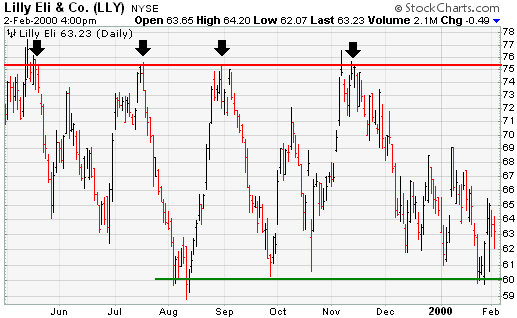

## Strategy Implementation and Result:

### Crossover Strategy Based on Support and Resistance Levels

#### Description: 

- The central belief of the strategy is that once a stock undercuts the prior support levels, some traders may think the support level is broken and subject to have a price decline. However, if the stock is able to recover from the broken support later, it means there are buyers supporting those levels and the price may rise based on that belief. On the other hand, if a stock rallies above the prior resistance level, some traders may think the resistance level is broken and subject to have a price increase. However, if the stock is not able to hold that level and it dips below that level, it means there are not enough buyers supporting those levels and thus the price may decline based on that belief.

- Here is the algorithm that detects the support and resistance levels:
  
  - Detecting Support: If there are $`n_{1}`$ consecutive lower low candles before the candle on date $`x`$, and $`n_{2}`$ consecutive higher high candles after the candle on date $`x`$, then the low of the candle on date $`x`$ is a support level.

  - Detecting Resistance: If there are $`n_{1}`$ consecutive higher high candles before the candle on date $`x`$, and $`n_{2}`$ consecutive lower low candles after the candle on date $`x`$, then the high of the candle on date $`x`$ is a resistance level.

  For example, if the parameters $`n_{1} = 2`$ and $`n_{2} = 2`$, then the green line and the red line in the image below indicate the support and resistance levels respectively.

  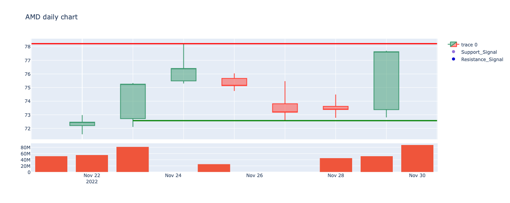

- We wrote a python script that generate visualizations of the support and resistance levels of a stock and we noticed that often some price levels are very close to each other, and the graph became very messy, thus we decided to merge some price levels if they are close to each other.

- Here is a graph of SPY support(green line) and resistance(red line) levels before merging price levels:
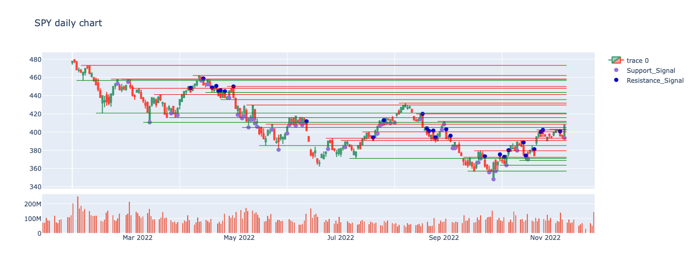

- Here is a graph of SPY support and resistance levels after merging price levels:
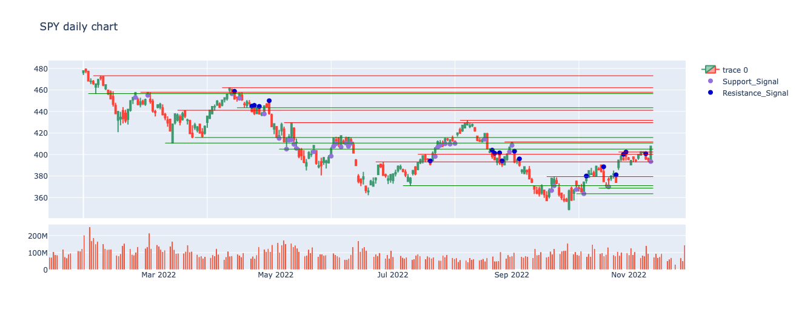

### Illustration of the strategy:

- If a stock undercuts a prior support line and then rallies back above the line, then we would buy the stock. 
- If a stock rallies above a prior resistance level and then drops below that level, then we would short the stock. 

The following figure illustrates the buy (purple dot) and sell (blue dot) signals of the strategy:
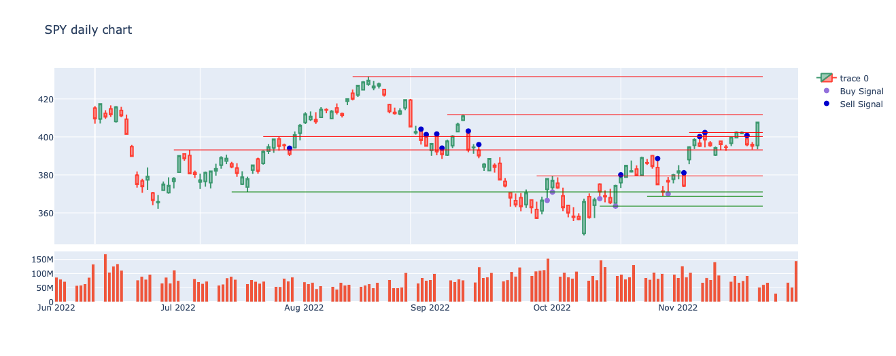


Risk Management and Position Size of the strategy: 

- After identifying different support and resistance levels of a stock, we notice that different price levels are not equally significant. For example, the price levels one month ago maybe more than significant than that of one year ago. Also, the price level with more trading volume maybe more than significant than that of lower volume. As a result, we decided to weigh those price levels based on time and volume using exponential weighting method. After that, we further categorized the raw weighting number of those support and resistance levels into three classes which are less aggressive, normal, and aggressive position size.

- The weighting method is similar to one of the value at risk calculation method called weighted historical simulation. It will assign a time decaying weight for each observed value. For example, the more recent support/resistance lines will have a more significant weight while a remote one will not. Also volumes are considered here, we combined the time weights together with volume weights and scale all weights so that the maximum would be one. After that, we are able to see which support/resistance lines might be more worthy to invest in. Later we also created a stop loss rule based on these weights. We divided the weights into three groups based on 1/3 and 2/3 quantiles. Lines within the highest quantiles represent aggressive rules while lines within the lowest quantile represent preservative rules.

Let $`\mu`$ and $`\sigma`$ be the mean and standard deviation  of those raw weighting number of all price levels
- If the raw weighting number $`< \mu - \sigma`$, then we categorized it as less aggressive position size (i.e. the strategy only risks 0.5% of total equity)
- If $`\mu -\sigma \leq`$ raw weighting number $`\leq \mu +\sigma `$, then we categorized it as normal position size (i.e. the strategy only risks 1% of total equity)
- If the raw weighting number $`> \mu + \sigma`$, then we categorized it as aggressive position size (i.e. the strategy only risks 2% of total equity)

To ensure exactly how much we are going to risk in each trade, we decided to add stop loss order on every trade. For example, if we have a 1 million account and we only want to risk 1% of total capital i.e. $10000 and risks only $1 per share on that trade, then the position size is 10000 shares.

Moreover, in order to maintain positive expectation from our strategy, we also add a profit taker in our strategy, and profit taker % is always twice of the stop loss. For example: if the stop loss is set at 1%, then the profit taker will be set to 2%. In other words, we expect to have $2 profit for every $1 that we risk. Having both stop loss and profit taker as well as maintaining positive risk to reward ratio can keep both risk and drawdown to minimum.

## The Strategy Studio Backtest Result Analysis

Due to limited hard drive storage, we are only able to backtest our strategy from 2022-Mar-02 to 2022-Mar-08. After Strategy Studio finished backtesting, it outputs three files, which are fills, orders, and PnL(Profit and Loss), and we are going to focus mainly on the PnL `csv` file, which has three columns: Strategy Name, Time, and Cumulative PnL. 

We measure the strategy performance by the following metrics:
- Cumulative PnL Percentage
- Sharpe Ratio (which measures the performance of an investment by taking risk into account) 

```math
\text{Sharpe Ratio} = \frac{\text{actual or expected return of portfolio} - \text{risk-free rate}}{\text{standard deviation of the porfolio's excess return}}
```

- Sortino Ratio (A return/ risk measure that only penalizes downside volatility)

```math
\text{Sortino Ratio} = \frac{\text{actual or expected return of portfolio} - \text{risk-free rate}}{\text{standard deviation of the downside}}
```

Although Sharpe Ratio is the most widely used return/ risk measure, it penalizes upside volatility (which means having huge return in some data point can lower the Sharpe). On the other hand, Sortino Ratio is a similiar metric like Sharpe Ratio but it only penalizes downside volatility. So, we can evaluate our strategy better by looking at both metrics.

- Maximum Drawdown

```math
\text{Max. Drawdown} = \frac{\text{Trough Value - Peak Value} }{ \text{Peak Value} }
```

Here is the Strategy Studio Backtest Result of our strategy:


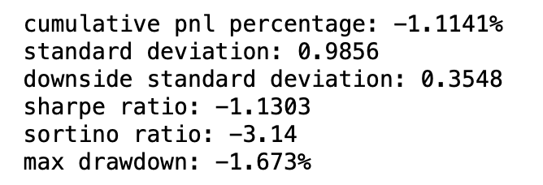

### Analysis 
For the backtesting, we only trade the following stocks: `DIA`, `AAPL`, and `TSLA` from 2022-Mar-02 to 2022-Mar-08. From the above figures, the strategy loses about 1.11% in the end. Although the strategy loses money, it does not result in a huge loss and the maximum drawdown is only -1.673%. The reason of having such a small drawdown is because we implemented stop loss in our strategy, which greatly reduces the risk involved. There are two possibles reasons of why the strategy does not generate positive return. Firstly, the strategy is only trading with three stocks during the backtesting phrase. Secondly, we are only backtesting with few days of data. Thus, the strategy is not placing a lot of orders because there are not that much trading signals occured with those three stocks within that short period. In general, we are not that confident with our result, and we believe the result can be greatly improved by trading with more stocks and backtesting with more data.

## Python Initial Research Backtest Result:

We will demonstrate our visual results in Python with Plotly package. We have encountered an issue with writing the entire back-test system in python, that is we are not able to add any sort of buy-limits, sell-limits, order book depth, and our capital in our python research during this project. Therefore, in most of the python visualization part we will be ignoring some of these factors and use a relatively simple strategy for our research. 

Another issue that we encountered in doing our research in python is that we are not able to obtain and backtest our strategy with intraday data, within a reasonable backtest time. In this case we have decided to use OHLC (Open High Low Close) data for this research. 

We will back-test our strategy with a time window of 2 years: 2020-12-07 to 2022-12-07. 

The strategy that our team used in this research section is as such:

1. Generate support/resistance lines
     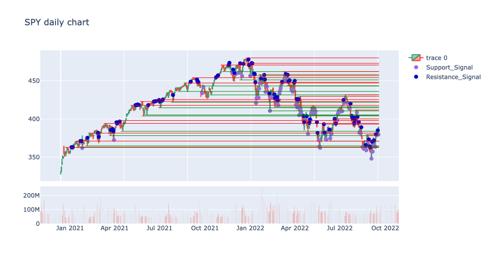
     
     As shown in the graph, the green and red horizontal lines represents the generated support/resistance lines during the 2 year backtest time period.
     
2. Generate support/resistance line triggered trade signals
   
      As shown in the graph above, the purple and blue dots represents the generated buy/sell signal. This is where the candle bars crosses over the support/resistance bands.

3. Execute trades:
      
      As mentioned in the previous section, it is hard for us to implement a market-accurate back test system, which takes our capital, order size, order time, and order book depth into account in python. Therefore, there are a lot of assumptions made in this trade execution.

      - The first assumption that we made is that we are able to execute our trade at the exact time that we place our order, and our order is guaranteed to get filled.

      - The second assumption is that we do not have a specific capital amount, which is saying that our trade will be matched at the best bid/ask, and we are essentially using only the best bid/ask for this research.
   
   To further explain the 2nd assumption, we'll need specify our strategy first. The strategy is to go "all in" at market open, if there is a trade signal triggered yesterday. And we will close our position at market close, then wait for the next signal.

   More specifically, we are basically comparing the open price vs the close price based on this strategy logic. We are hoping that a long signal (purple dot) yesterday means that today's close price will be higher than today's open price, and vice versa (blue dot).

   In this case, the return will be calculated by only today's close price and open price. And our protfolio's net worth will be calculated by the daily returns.

Our portfolio's backtest result on SPY is:

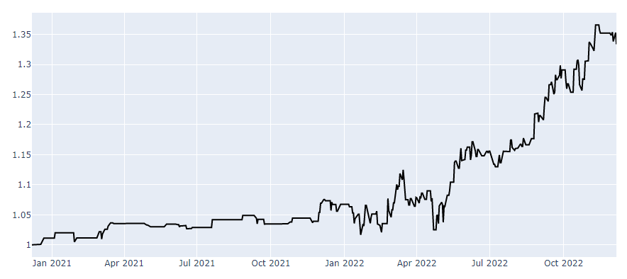

This strategy is based on an equal weighted support and resistance signals. We have also developed another support and resistance signals with exponential weights.

The similar signal graph on SPY: 

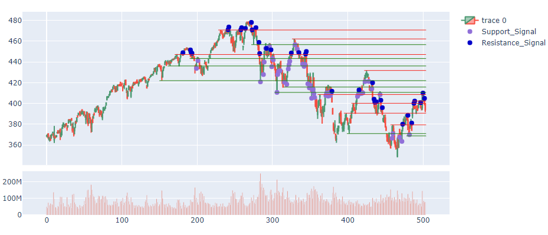

and the net worth of portfolio:

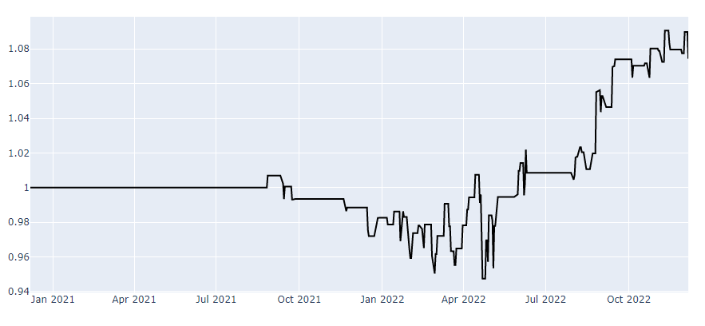

and comparing the equal weight and exponential weights:

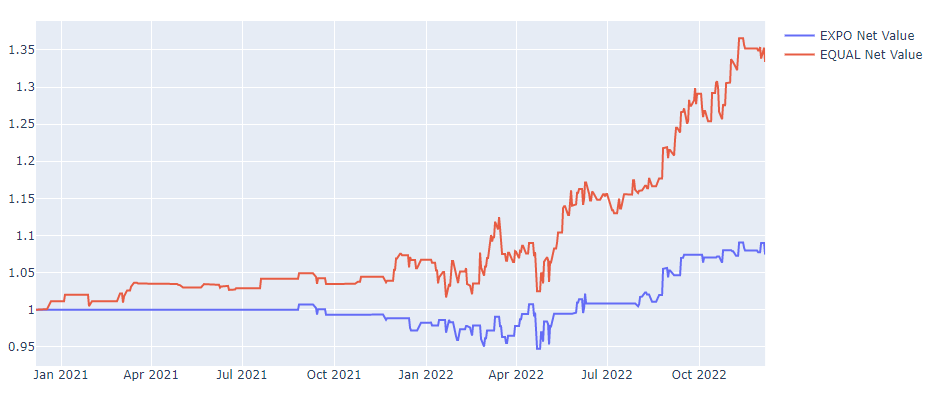

We notice that there are more trade signals in SPY and the overall return is slightly higher. However, this conlusion does not apply to all stocks, in some stocks the equal weight works better, and some others the exponential weight works better. In this case, we would like to do some research to see investigate what kind of stocks that this strategy works best on.  


## Research on the Results

Unfortunately, we were not able to find any specific meaningful results. Mostly it is because this strategy simply does not work really well, or it could also be that we are making a lot of assumptions here. If given more time, we should be doing research on some capital allocation models on this strategy, or optimize the parameters. We could also add some other factors and indicators (e.g. momentum, MA, etc.) to help with filtering the stocks boosting the performance.

Here are some of the results that we obtained.

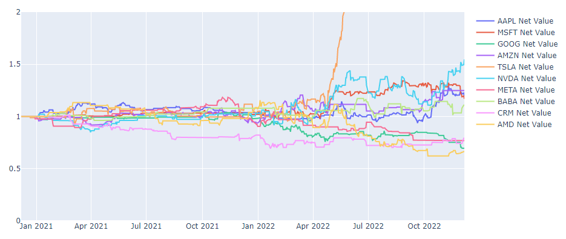
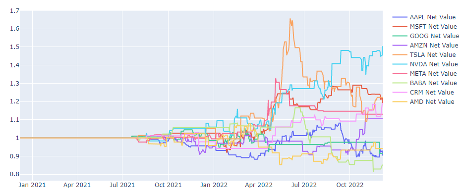

Above is a comparison of the net returns on strategies implemented on each of these big tech companies, with first one being equal weighting, and second one being exponential weighting of the support/resistance signals. Tesla generates the most profit but it could simply because of Tesla's net worth sky rocketed during this time period.

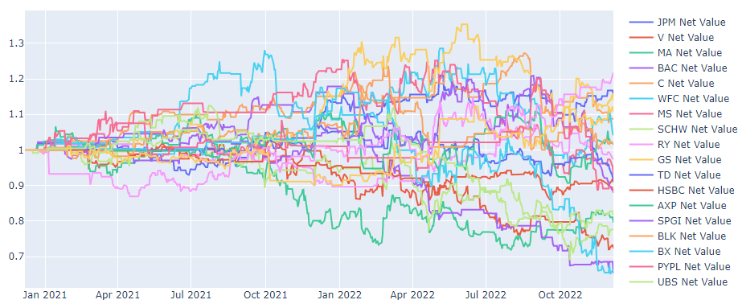
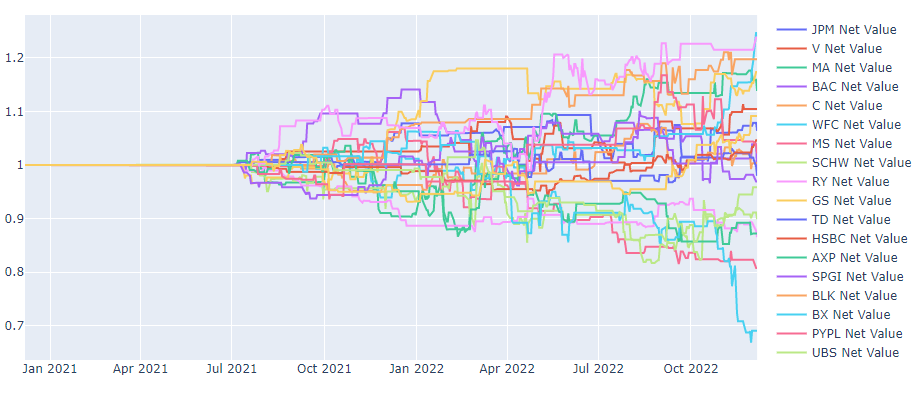

Above is a comparison of the net returns on strategies implemented on each of these financial services companies, with first one being equal weighting, and second one being exponential weighting of the support/resistance signals. The performance of this sector looks very similar.

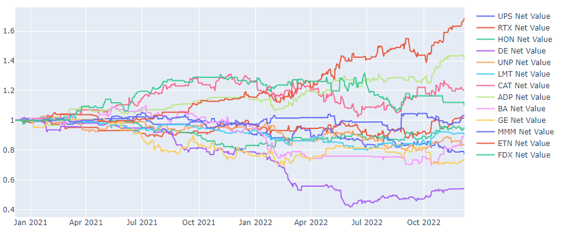
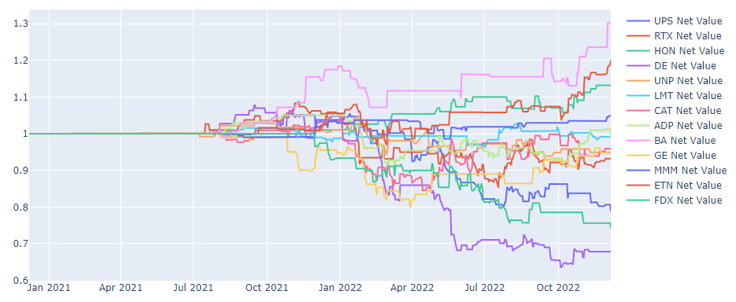

Above is a comparison of the net returns on strategies implemented on each of these industrial companies, with first one being equal weighting, and second one being exponential weighting of the support/resistance signals.

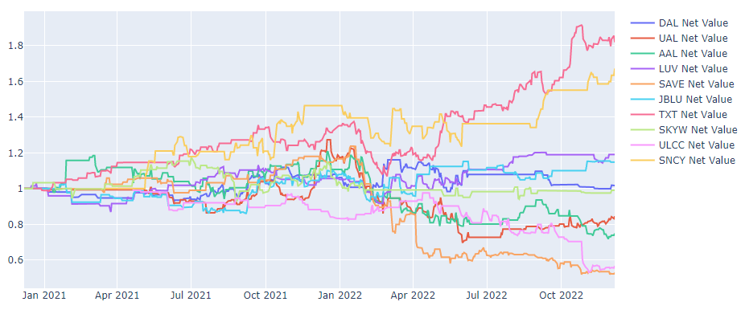
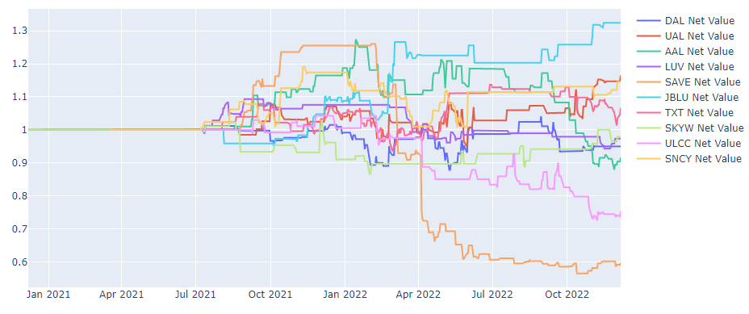

Above is a comparison of the net returns on strategies implemented on each of these air line companies, with first one being equal weighting, and second one being exponential weighting of the support/resistance signals.

In conclusion, unfortunately there is no significant findings in these graphs.

Another interesting comparison that we tested is that to see if some valuation factors has some impact on the strategy.

From 4 of the above sector stock lists, we have picked 2 highest market cap companies and 2 lowest market cap companies, so 16 stocks in total, and we would like to see if market cap has any impact on the performance.

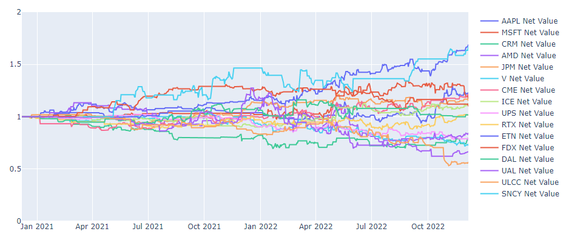
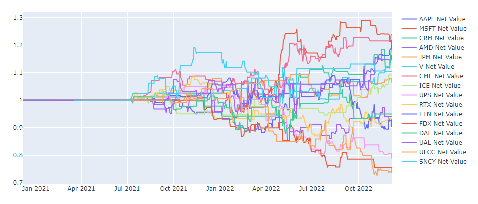

And similarly, we do not observe any relationship bewteen market cap and our strategy. If given more time, we can also test other factors such as Implied Volatility, Earnings per Share, P/E ratio, etc. to see if there is any other relationship.


## Screenshots and Example Outputs:

## Postmortem Summary:
### Norman Yeo
1. What did you specifically do individually for this project?
   - I worked on most things technology related. This included setting up the environment, Vagrant, StrategyStudio Setup, creating backtesting scripts and git workflow.
   - I worked on the C++ side of the project, including writing the entire strategy in C++. I worked with King to alter our strategy based on StrategyStudio's limitations.  
2. What did you learn as a result of doing your project?
   - I learned how to work with strategy studio and how to do research and backtest strategies on python as well. 
   - I also learnt the basics of managing and setting up a technical project.  
3. If you had a time machine and could go back to the beginning, what would you have done differently?
   - I would have set up the development environment for strategy studio much earlier to figure out the various quirks. For example, the only quote data we were able to get was trade executions.
   - I would have improved my development environment to reduce the time needed to compile and backtest. This would have resulted in a shorter feedback loop and overall more time put into development. For example, I would have set up a proper IDE and more modular backtest scripts that I didn't have to update every time I wanted to run.

4. If you were to continue working on this project, what would you continue to do to improve it, how, and why?
   - I would get the datasource running for quote data. I believe this is an issue not with the parser but with the StrategyStudio settings. This would allow us to write better informed strategies.

5. What advice do you offer to future students taking this course and working on their semester long project (be sides “start earlier”... everyone ALWAYS says that). Providing detailed thoughtful advice to future students will be weighed heavily in evaluating your responses.
   - Have a log of what is discussed every week during meetings
   - Have each team member report what they did for the week, what they are going to do, and any potential blockers that other team members need to settle
### King Chak Ho
1. What did you specifically do individually for this project?
   - I developed and refined the trading strategy based on my own observations in the market: suggest using support and resistance levels to make a strategy, suggest implementing a weighting system for those price levels, and suggest adding stop loss and profit taker in strategy to minimize risk.
   - I implemented the algorithm that detects support and resistance levels of any stock and made visualizations of those support resistance levels.

   - I wrote a python script that categorizes the weights of price level into three different classes( which correspond to different position sizing of each trade), and the script also generates a csv file that contains support and resistance levels and the corresponding position size class.
   - I wrote a python script that interprets and measures the performance of the strategy as well as making visualization of the result.
   - I also worked on writing the final report of this project, including the project description, the components, and the strategy implementation and result part.


2. What did you learn as a result of doing your project?
   - I learned about the process of developing and designing high frequency trading strategy, which includes researching for strategy ideas, using python to test the initial research result, implementating the actual strategy in C++, analyzing the backtest result and improving the strategy. Also, I learned to how to refine and improve the strategy's performance by introducing additional features such as having stop loss, profit taker and weighting different price levels.

   - I also learned a lot using git and gitlab as a tool to track and manage changes of the project.

3. If you had a time machine and could go back to the beginning, what would you have done differently?
   - I would buy an external hard drive to download the IEX data as soon as I can, so that we can have a much long term backtest result.
   - I would solely focus on developing the trading strategy using Strategy Studio OnTrade functions only because we discovered in the last two week that the Strategy Studio OnQuote and OnBar function did not work, and we had to modify our strategy accordingly to work with OnTrade function.

4. If you were to continue working on this project, what would you continue to do to improve it, how, and why?
   - I would improve the strategy by taking considerations of round number levels as well because traders love trading around round numbers as they represent psychologically important levels.
   - I would backtest the strategy using more historical data possibly more than one year of data.


5. What advice do you offer to future students taking this course and working on their semester long project. Providing detailed thoughtful advice to future students will be weighed heavily in evaluating your responses.

   - It is very important to have a clear and detailed task for every team member every week since a vague description of task can slow down the overall progress of the team project. Also, each team member should report their progress every week, which can faciliate the coordination of the project.

   - If you are building a trading strategy, I would suggest allocating more time on implementating the strategy itself rather than spending too much time researching on the best trading ideas. Fail fast and move on is the nature of developing trading strategy.


### Yipu Jin
1. What did you specifically do individually for this project?
   - I mostly worked on strategy research part in Python. I wrote the basic backtest PnL logic and plot our PnL graph based on the assumption for our backtest. With this PnL graph, we will be able to generate further insights to modify, and optimize the strategy algorithm. I have also compiled, cleaned, and optimized our strategy logic (both equal weight and exp weight) into a function for easier tuning. I have also analyzed our strategy to see if there are some factors or indicators that can impact the performance of this algorithm. By doing so, I was hoping to research on alpha boosting of this strategy. I have explored multiple factors and plot their influence on the PnL curves for visualization.

2. What did you learn as a result of doing your project?

   - I have learned that the most important thing of developing a strategy is the basic fundation and its logic. If we expect a strategy to work, we should spend more time in proving that this fundation logic is feasible, rather than spending time in optimization and parameter tuning.

   - I have also learned to utilize a lot of technology stacks such as Git, and high frequency trading frameworks such as Linux Operating System and Strategy Studio.

3. If you had a time machine and could go back to the beginning, what would you have done differently?

   - Validation. I would have tried to validate the fundamentals of our strategy. We spent a lot of times trying to optimize it instead of a validation that this algorithm can indeed work in the market.

   - A backtest framework. Our research part is limited because of the lack of a good backtest framework. I would have written a more rigorous backtest system to more accurately reflect our strategy's behaviour in the market. 

   - Better Teamwork. I would have tried to setup a timeline for this strategy. There were multiple technical difficulties that our team encountered. Therefore, having a pre-determined schedule would really help in this case.

4. If you were to continue working on this project, what would you continue to do to improve it, how, and why?

   - If given more time, I will test other factors such as Implied Volatility, Earnings per Share, P/E ratio, etc. to see if there is any other relationship.

   - If i were to continue working on this project, the most important thing is to build a more rigorous backtest system in python. This current backtest function that I have built is very basic and it cannot mimic the real market behaviours. Therefore, I should build a complete backtest solution before we dive into any research part, for a more accurate and meaningful research purpose.


5. What advice do you offer to future students taking this course and working on their semester long project (be sides “start earlier”... everyone ALWAYS says that). Providing detailed thoughtful advice to future students will be weighed heavily in evaluating your responses.

   - To explore more options and think thoroughly. A lot of times when you are half way through your project and then you realize either it is not going to work, or it is going to take too much time. If you spend time to validate that this idea will work, then the whole process and workflow will be smoother.


### Yuhao Wang
1. What did you specifically do individually for this project?

   - For this project, I was mainly doing three tasks. The first is to figure out a method to reflect the importance of different support and resistance lines by considering the time and volumes. To achieve this, I read a method used in value at risk calculation which is called weighted historical simulation. I borrowed that method and tried different parameters to make it reflect time influence so that the most recent s/r lines will have more weights. Then I combined it with volume weights to get a finalized weight for each s/r line. The second task is to back-test in Python as a reference for later C++ implementation. I wrote the return calculation part using pandas dataframe and also made some net value plots using matplotlib to show the back-test result. The third one is to add a stop loss strategy in Python to see if there is any improvement in the profit. I divided the weights into three groups, they were not aggressive, normal, aggressive respectively. And the corresponding stop loss percentages were 0.5%, 1% and 2%. Then I also made some plots for this strategy. For the documentation part, I set up the template for the team and took over the technology part.

2. What did you learn as a result of doing your project?

   - First thing is that I learned about the strategy development process through this project. When we have an idea, we can start with a very simple strategy to test on. Then we can add more complicated things to try to improve the strategy performance.  The second thing is that I learned about the calculation of risk measures and had a better understanding of support and resistance lines. Lastly, I learned about how to use Gitlab to see what changes have been done to the project branches. This would be very useful for version control.

3. If you had a time machine and could go back to the beginning, what would you have done differently?

   - I would try to start earlier so that I can also take part in the algorithm designing part. That part was very interesting for me. And when we discussed about something in the meeting, we should write it down in Discord chat so that we will not forget what we’ve decided to do after the meeting. I also wish I had more time to read more papers so that I may be able to brainstorm more ideas and be more responsive to my teammates, the graduating semester has been really busy.

4. If you were to continue working on this project, what would you continue to do to improve it, how, and why?

   - Try different observation horizons to determine the support and resistance lines to see if there would be any improvement. Because currently we are only using some predetermined parameters to do the back-test.

   - Might think of position size adjusting as well. Because currently it’s like all in or all out based on signals and stop loss rules.

5. What advice do you offer to future students taking this course and working on their semester long project (be sides “start earlier”... everyone ALWAYS says that). Providing detailed thoughtful advice to future students will be weighed heavily in evaluating your responses.

   - Try to meet twice a week, one for assigning tasks, one for checking progress. Make sure after each meeting, everyone knows his to-do list, better take notes in Discord while meeting.

   - If you are designing a strategy, then at the beginning every member can participate in initial idea designing but later when you have something to try, you can divide your team so that some can work on implementation while others trying to improve the current strategy. In this case everyone can do much more things.


## Reference:
1. https://school.stockcharts.com/doku.php?id=chart_analysis:support_and_resistance
